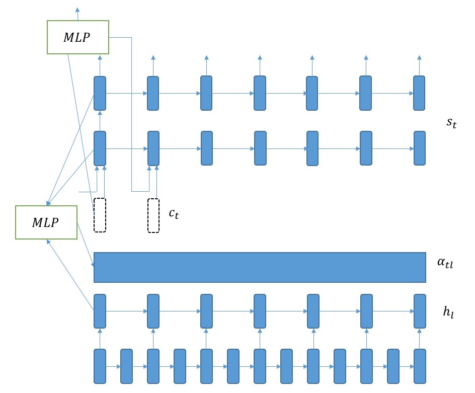

Introduction
------------

This repo contains an end-to-end speech recognition system implented using
tensorflow. It uses bidirectional LSTMs in the encoding layer with attention
in the decoding layer. The LSTMs in the encoding layer are strided and in every
layer, the time dimension is reduced by 2.

Model
-----

Default configuration contains 3 bidirectional layers for encoding and decoding
layer:

Current results
---------------

I am getting round 15% WER in dev93 by training in si284 set.

