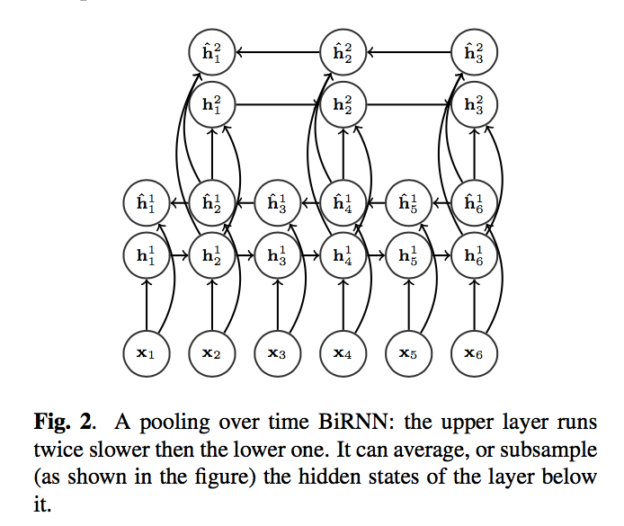
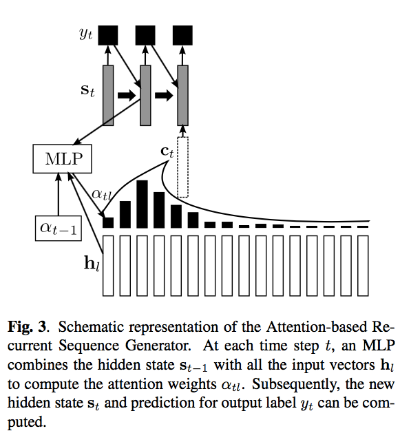

Some parts are curently wrong in this file

Introduction
------------

This repo contains an end-to-end speech recognition system implented using
tensorflow. It currently works on Wall Stret Journal Corpus. It uses
bidirectional LSTMs in the encoding layer with attention in the decoding layer.
The LSTMs in the encoding layer are strided and in every layer, the time
dimension is reduced by 2. The complete model looks much like one from [1].

#### Encoding layer(default configuration contains 3 bidirectional layers):



#### Decoding layer:



Description
-----------

There are three main files in the code:

- `data.py` contains functions for loading the data
- `seq2seq_model.py` contains attention based model
- `train.py` contains code for training and evaluating the model

Usage
-----

Install `tensorflow` and `python_speech_features` first before running.


```
usage: train.py [-h] [--numcep NUMCEP] [--keep-prob KEEP_PROB]
                [--max-output-len MAX_OUTPUT_LEN] [--rnn-size RNN_SIZE]
                [--num-layers NUM_LAYERS] [--batch-size BATCH_SIZE]
                [--learning-rate LEARNING_RATE] [--num-epochs NUM_EPOCHS]
                [--beam-width BEAM_WIDTH]
                [--learning-rate-decay LEARNING_RATE_DECAY]
                [--min-learning-rate MIN_LEARNING_RATE]
                [--display-step DISPLAY_STEP] [--data-dir DATA_DIR]
                [--job-dir JOB_DIR]

optional arguments:
  -h, --help            show this help message and exit
  --numcep NUMCEP
  --keep-prob KEEP_PROB
  --max-output-len MAX_OUTPUT_LEN
  --rnn-size RNN_SIZE
  --num-layers NUM_LAYERS
  --batch-size BATCH_SIZE
  --learning-rate LEARNING_RATE
  --num-epochs NUM_EPOCHS
  --beam-width BEAM_WIDTH
  --learning-rate-decay LEARNING_RATE_DECAY
  --min-learning-rate MIN_LEARNING_RATE
  --display-step DISPLAY_STEP
  --data-dir DATA_DIR
  --job-dir JOB_DIR
```

Current results
---------------

I am getting 29.77% WER and 12.73 CER for validation set using the latest code
(91c2ed5).


Future aims
-----------

My aim to get around 10% WER, as reported by many RNN based papers. The
biggest thing that can impact the accuracy is the explicit language model, which
I plan to start implementing soon. Also I plan to experiment with many things
that are not currently present like normalization of features, to see if they
can improve the accuracy.

[1]: Dzmitry Bahdanau, Jan Chorowski, Dmitriy Serdyuk,
Philemon Brakel, and Yoshua Bengio, “End-to-end
attention-based large vocabulary speech recognition,”
arXiv preprint arXiv:1508.04395, 2015
